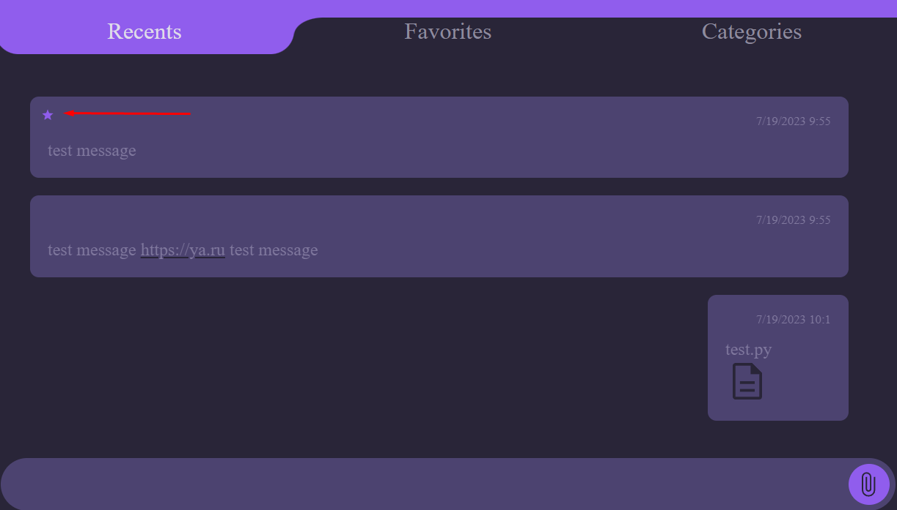

GitHub Page - https://nilumilak.github.io/ahj-diploma/

## Выполнены функции:

### Основные

- сохранение в истории ссылок и текстовых сообщений;

- ссылки (http:// или https://) должны быть кликабельны и отображаться, как ссылки;

- сохранение в истории изображений, видео и аудио (как файлов) — через Drag & Drop и через иконку загрузки;

- скачивание файлов на компьютер пользователя;

- ленивая подгрузка: сначала подгружаются последние 10 сообщений, при прокрутке вверх подгружаются следующие 10 и т. д.

### Дополнительные

- синхронизация: если приложение открыто в нескольких окнах или вкладках, то контент должен быть синхронизирован;

- добавление сообщения в избранное, должен быть интерфейс для просмотра избранного;

